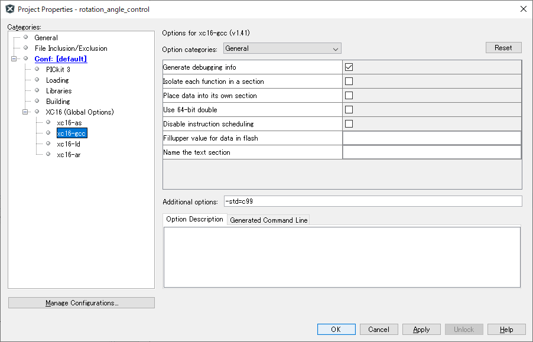

# 概要
電磁弁を制御するためのスレーブ．

<br>
<br>

# リポジトリ構成
```tree
├── circuit --> 回路図，基板データ
└── program --> プログラム
```

<br>
<br>

# 動作確認環境
- IDE : MPLAB X IDE v4.15
- コンパイラ : XC16 v1.41
- コンパイルオプション : -std=c99
    - File -> Project Properties -> Categories: -> Conf: [default] -> XC16(Global Options) -> xc16-gcc -> Additional options: で指定



<br>
<br>

# 通信データ ( M->S )

| byte | 内容 |
|:-:|:--|
| 1 | ON / OFF ( 1ch ~ 8ch )|
| 2 | ON / OFF ( 9ch ~ 16ch )|

<br>
<br>

# 使用している周辺モジュール

* UART1(RX) ：Raspberry Pi との通信